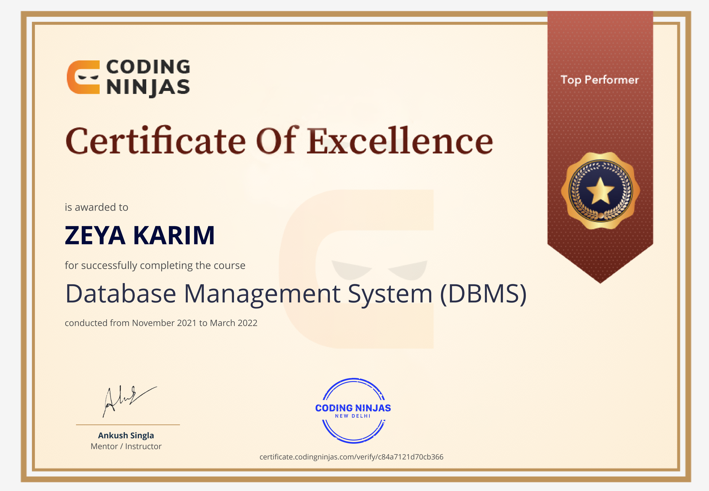

# 👋 Hi, I'm Zeya Karim

### Software Engineer · Full Stack · Backend · Cloud & DevOps

I build **production-ready web applications, scalable backend systems, and end-to-end digital products** — from architecture and database design to APIs, frontend interfaces, cloud infrastructure, CI/CD, and deployment.

With **4+ years of professional experience**, I've worked across **e-commerce, logistics, warehouse management, and business operations**, building systems around real-world workflows, integrations, and scalable backend architecture.

<p align="center">
  <a href="https://zeyakarim-me-seven.vercel.app/" target="_blank" rel="noopener noreferrer">
  
</a>

<a href="https://www.linkedin.com/in/zeya-karim-a1362a203/" target="_blank" rel="noopener noreferrer">
  
</a>

<a href="mailto:zeyakarim79@gmail.com">
  
</a>

<a href="https://zeyakarim.github.io/resume.pdf" target="_blank" rel="noopener noreferrer">
  
</a>
</p>

---

## ⚡ At a Glance

| | |
|---|---|
| 👨‍💻 **Experience** | 4+ Years |
| 🏗️ **Primary Focus** | Full Stack & Backend Engineering |
| ⚛️ **Frontend** | React.js · Next.js · TypeScript · JavaScript |
| ⚙️ **Backend** | Node.js · Express.js · Python · FastAPI |
| 🗄️ **Databases** | PostgreSQL · MongoDB · Redis · Supabase |
| ☁️ **Cloud** | AWS · Cloudflare · Linux VPS |
| 🏗️ **Architecture** | REST APIs · Microservices · Event-Driven Systems |
| 🚀 **Deployment** | Docker · Nginx · PM2 · GitHub Actions · CI/CD |
| 👥 **Leadership** | Led & Mentored 6–7 Engineers |
| 🛒 **Domain Experience** | E-commerce · Logistics · Warehouse · Business Operations |
| 📈 **Scale** | 5,000+ SKU Marketplace Experience |
| 🟢 **Availability** | Open to Work |                                         |

---

## 🧑‍💻 About Me

```ts
const zeya = {
  role: "Software Engineer",
  experience: "4+ Years",

  focus: [
    "Full Stack Development",
    "Backend Engineering",
    "Cloud & DevOps",
    "System Architecture",
  ],

  frontend: [
    "React.js",
    "Next.js",
    "TypeScript",
    "JavaScript",
    "Vite",
    "Tailwind CSS",
  ],

  backend: [
    "Node.js",
    "Express.js",
    "Python",
    "FastAPI",
  ],

  databases: [
    "PostgreSQL",
    "MongoDB",
    "Redis",
    "Supabase",
  ],

  architecture: [
    "REST APIs",
    "Microservices",
    "Event-Driven Systems",
    "Distributed Systems",
  ],

  cloud: [
    "AWS",
    "EC2",
    "S3",
    "RDS",
    "CloudFront",
    "Cloudflare R2",
    "Linux VPS",
  ],

  devops: [
    "Docker",
    "Nginx",
    "PM2",
    "GitHub Actions",
    "CI/CD",
  ],

  currently: "Building scalable products & exploring new opportunities",
  availability: "Open to Work",
};
```

---

## 🚀 What I Build

### 🛒 Commerce Platforms

Building complete commerce systems covering:

* Product & catalogue management
* Inventory management
* Customer workflows
* Order lifecycle
* Warehouse operations
* Payment processing
* Administrative platforms
* External API integrations

### 🚚 Logistics & Operations Platforms

Engineering systems around:

* Fleet management
* Shipment workflows
* Route management
* Geospatial operations
* Order synchronization
* Inventory synchronization
* COD reconciliation
* Business operations

### ⚙️ Backend Systems

Designing backend systems with:

* RESTful APIs
* Node.js & Express.js
* PostgreSQL & MongoDB
* Redis
* Microservices
* Event-driven architecture
* Background processing
* Third-party integrations
* Transaction-safe business logic

### ☁️ Cloud & DevOps

Taking applications from development to production through:

* AWS infrastructure
* Linux VPS
* Nginx
* PM2
* Docker
* Cloudflare
* GitHub Actions
* CI/CD pipelines
* Production deployment

---

# 🛠️ Technology Stack

### Frontend

<p>
  
</p>

### Backend

<p>
  
</p>

### Databases & Infrastructure

<p>
  
</p>

### Tools & Workflow

<p>
  
</p>

---

# 💼 Professional Experience

## Full Stack Engineer — Sappey Foods

**Mar 2026 – Present · Remote**

Building a unified commerce platform as a **sole engineer**, owning the product lifecycle across frontend, backend, database, infrastructure, and deployment.

### Key Contributions

* Architected and developed customer-facing and administrative systems.
* Built backend services using **Node.js, PostgreSQL and Supabase**.
* Implemented payment workflows using **Razorpay**.
* Designed inventory reservation and order lifecycle logic.
* Built product, customer, order and operational workflows.
* Managed production infrastructure on **Linux VPS**.
* Configured **Nginx, PM2 and Cloudflare R2**.
* Worked end-to-end across architecture, development and deployment.

**Stack:** `React.js` · `TypeScript` · `Node.js` · `PostgreSQL` · `Supabase` · `Razorpay` · `Nginx` · `PM2` · `Cloudflare R2`

---

## Senior Full Stack Engineer — GWARM Technologies

**Apr 2025 – Feb 2026 · Jaipur, India**

Worked on logistics, fleet management and business operations platforms while leading and mentoring a team of **6–7 engineers**.

### Key Contributions

* Led and mentored a team of **6–7 engineers**.
* Built a Next.js-based super-admin platform.
* Developed backend microservices using **Node.js & PostgreSQL**.
* Implemented event-driven workflows using **RabbitMQ**.
* Built fleet tracking and route-related functionality using **Google Maps API & PostGIS**.
* Worked with **AWS EC2, S3 and RDS**.
* Implemented CI/CD pipelines using **GitHub Actions**.
* Integrated order, inventory and shipment workflows with external platforms.
* Contributed to scalable backend architecture and business-critical workflows.

**Stack:** `Next.js` · `Node.js` · `PostgreSQL` · `RabbitMQ` · `PostGIS` · `Google Maps API` · `AWS`

---

## Full Stack Developer — DEPO24

**Sep 2022 – Feb 2025 · Delhi, India**

Developed an e-commerce and building-material marketplace supporting **5,000+ SKUs** and multiple operational roles.

### Key Contributions

* Built features for a marketplace supporting **5,000+ SKUs**.
* Developed vendor panels and administrative systems.
* Implemented permission-based access control.
* Integrated **Shopify GraphQL APIs**.
* Integrated **Vinculum middleware**.
* Worked extensively with MongoDB and PostgreSQL.
* Contributed across frontend, backend, database and business logic.
* Built workflows around catalogue, orders, vendors and operations.

**Stack:** `React.js` · `Node.js` · `MongoDB` · `PostgreSQL` · `Shopify GraphQL`

---

# 📌 Featured Engineering Work

## 🛒 Unified Commerce Platform

A complete commerce ecosystem covering customer storefronts, administration, inventory, orders and payments.

### Engineering Highlights

* Product & inventory management
* Order lifecycle management
* Warehouse workflows
* Payment integration
* Customer management
* Administrative operations
* Cloud object storage
* Production deployment
* Transaction-aware business workflows

**Stack:** `React.js` · `TypeScript` · `Node.js` · `PostgreSQL` · `Supabase` · `Razorpay` · `Nginx` · `PM2` · `Cloudflare R2`

---

## 🚚 Logistics & Fleet Management Platform

A business platform designed around fleet operations, order synchronization, route management and shipment workflows.

### Engineering Highlights

* Fleet tracking
* Route management
* Geospatial queries
* COD reconciliation
* Order synchronization
* Inventory synchronization
* Shipment management
* Event-driven backend services
* External platform integrations

**Stack:** `Next.js` · `Node.js` · `PostgreSQL` · `RabbitMQ` · `PostGIS` · `Google Maps API` · `AWS`

---

## 🏗️ E-Commerce Marketplace

A building-material marketplace supporting thousands of products and multiple operational roles.

### Engineering Highlights

* Product catalogue
* Vendor management
* Admin permissions
* Order workflows
* External API integrations
* Shopify integration
* Middleware synchronization
* Multi-role business operations

**Stack:** `React.js` · `Node.js` · `MongoDB` · `PostgreSQL` · `Shopify GraphQL`

---

# 🧠 Engineering Philosophy

> **Build it right. Understand the system. Own the outcome.**

I enjoy working on problems where engineering goes beyond writing components or APIs.

My approach is to understand the **business workflow first**, then design the architecture, database, APIs and infrastructure around it.

### I care about

* Clean and maintainable architecture
* Reliable backend systems
* Well-designed database schemas
* Secure authentication and authorization
* Transaction-safe business logic
* API performance
* Production reliability
* Developer experience
* Automated deployment
* Long-term maintainability

---

# 📊 GitHub Statistics

<p align="center">
  
  
</p>

<p align="center">
  
</p>

---

# 📈 Contribution Activity

<p align="center">
  
</p>

---

# 🎯 Currently

```text
▸ Building production-ready full stack applications
▸ Improving backend architecture & system design
▸ Exploring scalable distributed systems
▸ Working with cloud infrastructure & DevOps
▸ Exploring AI-powered engineering workflows
▸ Open to the next engineering opportunity
```

---

# 📚 Areas I'm Exploring

* System Design
* Distributed Systems
* Event-Driven Architecture
* Backend Performance
* Cloud Architecture
* Database Optimization
* Scalable API Design
* DevOps & Infrastructure Automation
* AI-powered Developer Tools

---

# 🎓 Education

**Bachelor of Technology — Computer Science & Engineering**

**Yamuna Institute of Engineering and Technology, Yamunanagar, Haryana**

**First Class with Honours**

---

# 📜 Certifications

<p align="center">
  
  
  
</p>

---

# 🤝 Let's Connect

I'm open to opportunities involving:

**Full Stack Engineering · Backend Engineering · Software Engineering · Cloud & DevOps**

If you're building an interesting product, growing a technical team, or looking for someone who can take ownership of a system from **idea → architecture → development → deployment**, feel free to reach out.

<p align="center">
  <a href="https://zeyakarim-me-seven.vercel.app/">Portfolio</a>
  &nbsp; • &nbsp;
  <a href="https://www.linkedin.com/in/zeya-karim-a1362a203/">LinkedIn</a>
  &nbsp; • &nbsp;
  <a href="mailto:zeyakarim79@gmail.com">Email</a>
  &nbsp; • &nbsp;
  <a href="https://zeyakarim.github.io/resume.pdf">Resume</a>
</p>

---

<p align="center">
  <b>Thanks for visiting my profile 👋</b>
  <br/>
  <sub>Building software, solving problems, and shipping things that matter.</sub>
</p>
